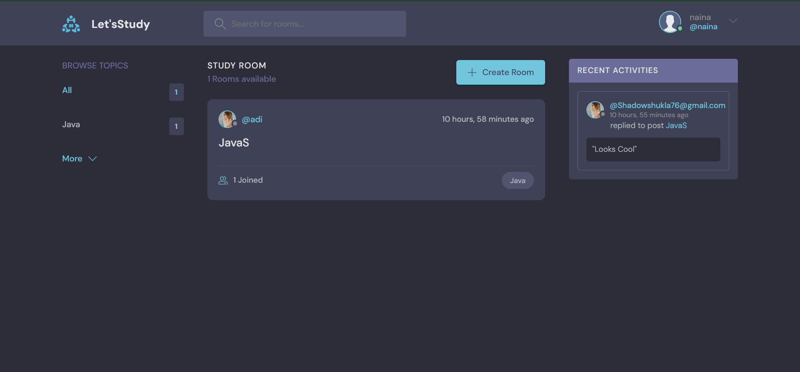
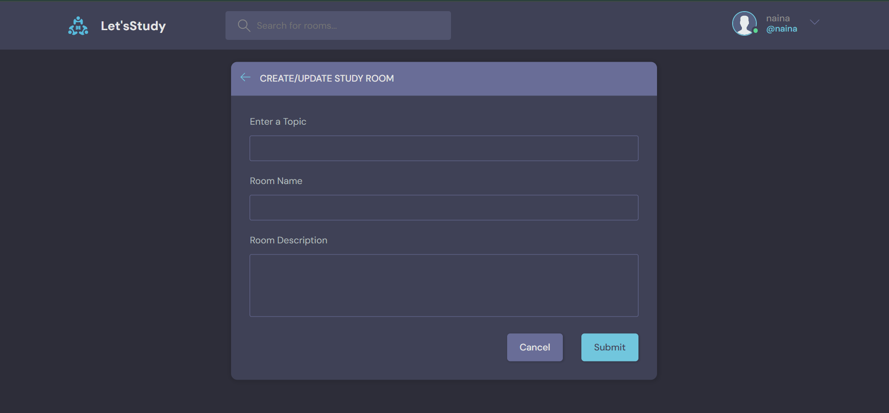
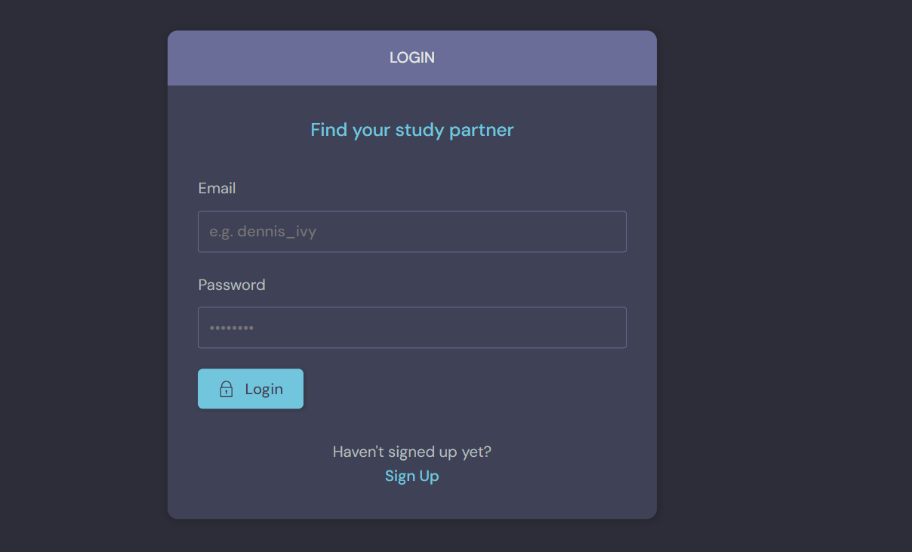
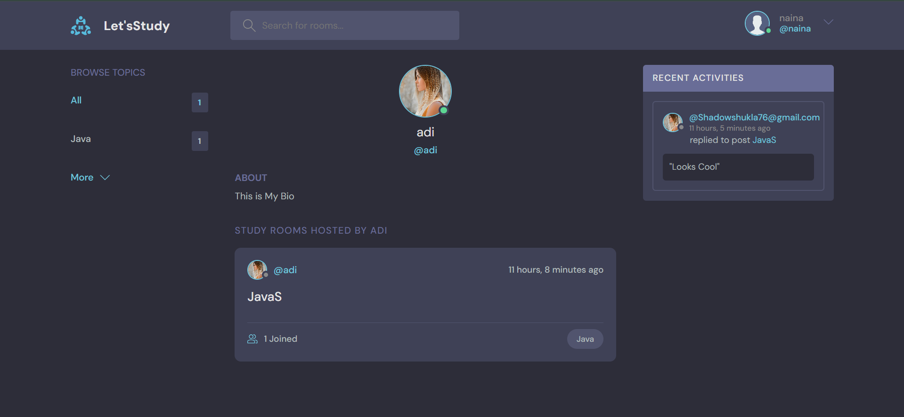

# **StudyRoom**

### Some Features
I Want you to Introduce to my new project StudyRoom. It is an Full Stack Project. Created with Help of Django and HTML,CSS and Js.
* It is an end to end platform in which user can create there account, update there account. 
* Create Study Rooms Related wit a certain Topic , Update the Room and Delete The Room. Other Users can Join your too. And And You Can Chat related to do the topic.
* Check User Profile and Rooms a certail User have created and how many participamts in the room.
* You Can Search And Filter room based on User, Room Name or Topic.
* I also created a Django Rest api to get information for rooms.

### Example Images

