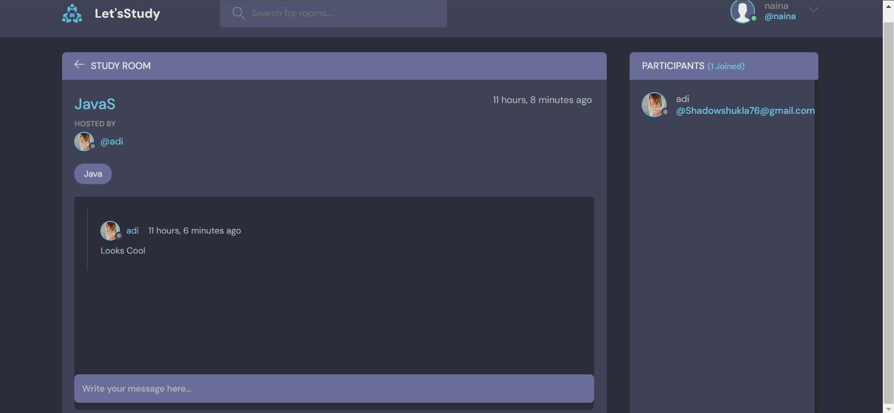

# **StudyRoom**


### Some Features
I Want you to Introduce to my new project StudyRoom. It is an Full Stack Project. Created with Help of Django and HTML,CSS and Js.
* It is an end to end platform in which user can create there account, update there account. 
* Create Study Rooms Related wit a certain Topic , Update the Room and Delete The Room. Other Users can Join your too. And And You Can Chat related to do the topic.
* Check User Profile and Rooms a certail User have created and how many participamts in the room.
* You Can Search And Filter room based on User, Room Name or Topic.
* I also created a Django Rest api to get information for rooms.


### Example Images





# Django Project Setup

This guide provides instructions for setting up a Django project from a GitHub repository, including creating a virtual environment and installing dependencies.

## Prerequisites

- Git
- Python 3.6 or higher
- pip

## Setup Instructions

1. **Clone the repository**:

    ```bash
    git clone [repo-url](https://github.com/ShadowAdi/letsstudy.git)
    cd letsstudy
    ```

2. **Create a virtual environment**:

    ```bash
    python -m venv venv
    ```

3. **Activate the virtual environment**:

    - **Windows**: `venv\Scripts\activate`
    - **macOS/Linux**: `source venv/bin/activate`

4. **Install dependencies**:

    ```bash
    pip install -r requirements.txt
    ```

5. **Apply database migrations**:

    ```bash
    python manage.py migrate
    ```

6. **Run the Django development server**:

    ```bash
    python manage.py runserver
    ```

7. **Additional commands**:

    - Create a superuser: `python manage.py createsuperuser`
    - Deactivate the virtual environment: `deactivate`

## License

This project is licensed under the MIT License.
